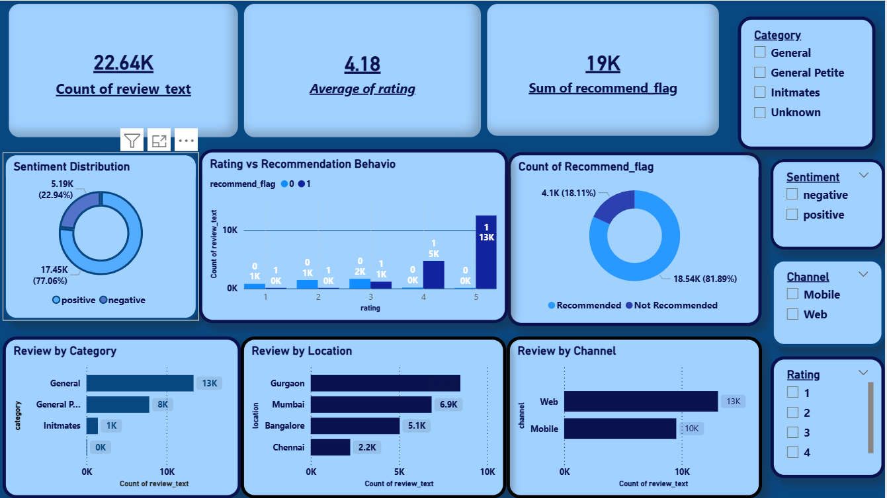
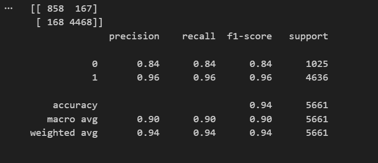

Customer Review NLP & Recommendation Prediction

An end-to-end Natural Language Processing (NLP) project analyzing customer reviews from a women’s clothing e-commerce platform to extract insights and predict product recommendations.

This project combines:

EDA → Text Cleaning → Sentiment Analysis → Topic Modeling → Machine Learning → Power BI Dashboard

Project Objective

The goals of this project are to:

Understand customer sentiment from review text
Identify key themes driving satisfaction & dissatisfaction
Predict whether a customer will recommend a product
Build an interactive dashboard for business decision-making

Tech Stack

Python (Pandas, NumPy)
Scikit-learn
NLP Techniques (TF-IDF, LDA)
Matplotlib & Seaborn
Power BI

Exploratory Data Analysis

Review count distribution by category
Review distribution by location
Channel analysis (Web vs Mobile)
Rating vs Recommendation behavior
Sentiment distribution (Positive vs Negative)

Key Dashboard KPIs:

22.64K Total Reviews
4.18 Average Rating
19K Recommendations

Text Preprocessing

Lowercasing
Removing punctuation & special characters
Stopword removal
TF-IDF Vectorization
Feature scaling (numeric + text features combined)

NLP & Topic Modeling

Used Latent Dirichlet Allocation (LDA) to extract key themes from reviews.
Major Themes Identified:
Fit & Sizing
Fabric Quality
Comfort
Product Design

Key Insight:

Fit and sizing are the strongest drivers of customer satisfaction and dissatisfaction.

Predict whether a customer will recommend the product (0 = No, 1 = Yes)

Features Used
TF-IDF review text
Rating
Age
Combined sparse feature matrix

Model Used

Logistic Regression
Selected for:
Interpretability
Good performance on high-dimensional text data

Model Performance

Outcome

This project demonstrates:

✔ Strong NLP preprocessing
✔ Topic modeling (LDA)
✔ Text + structured feature engineering
✔ High-dimensional model training
✔ ML evaluation with precision/recall
✔ Business dashboard integration
